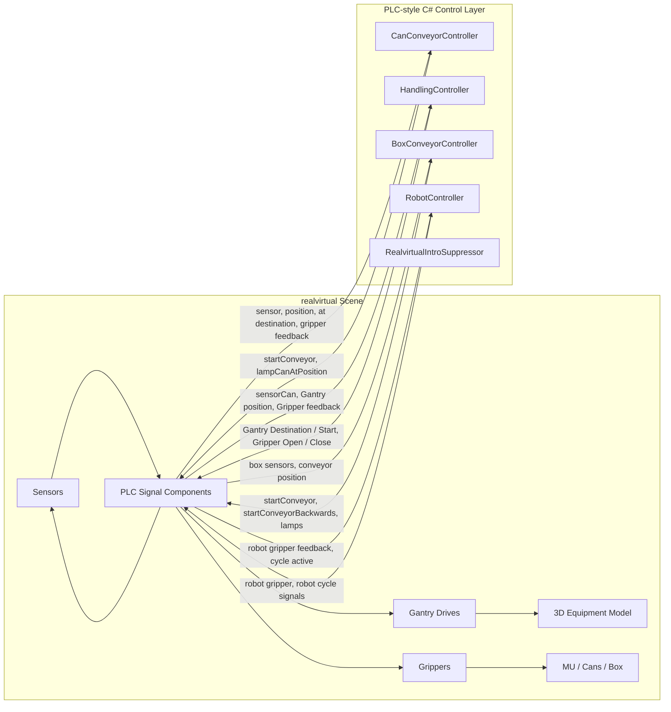
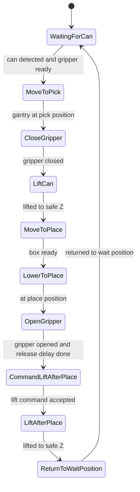
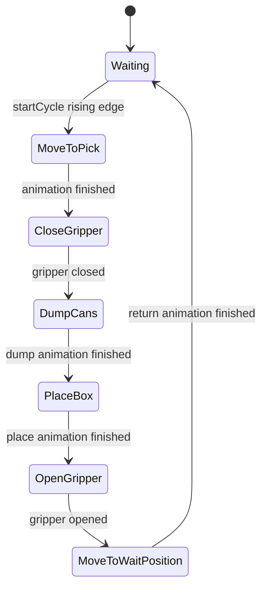
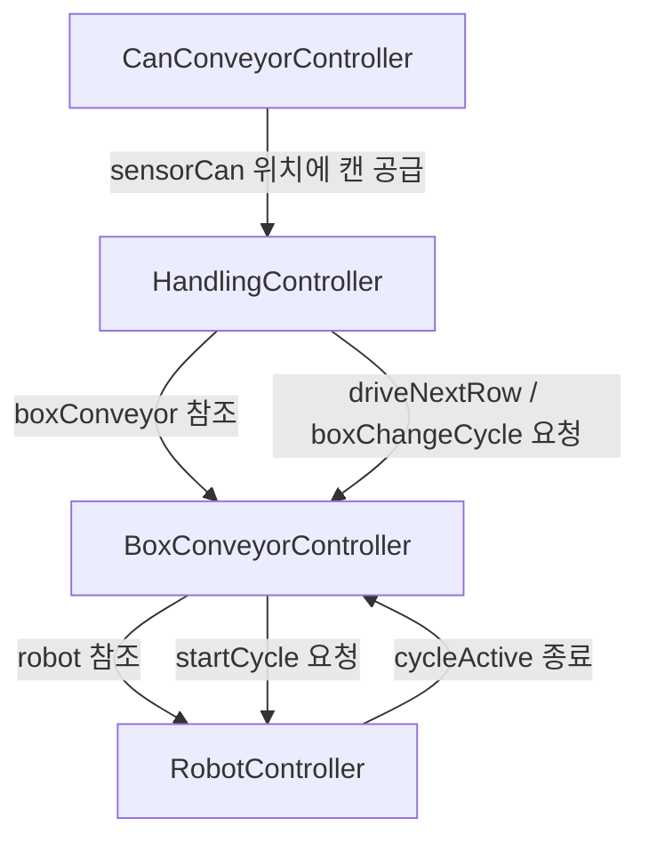
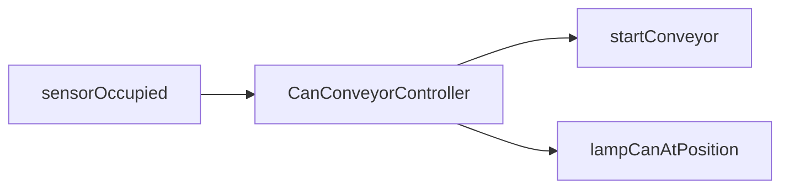
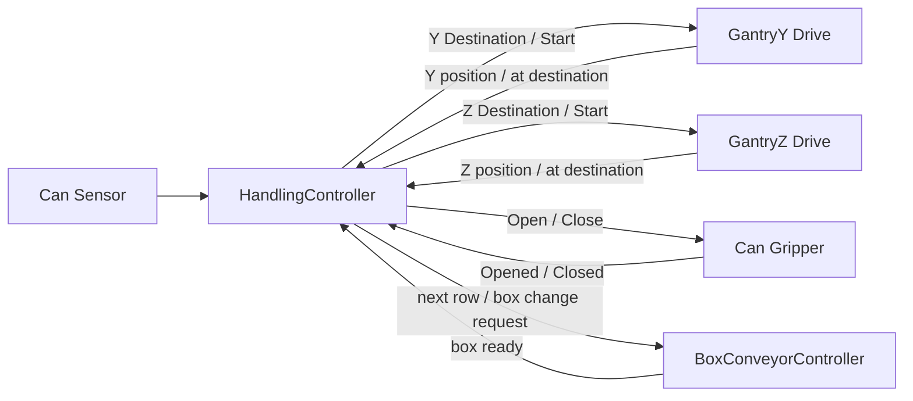
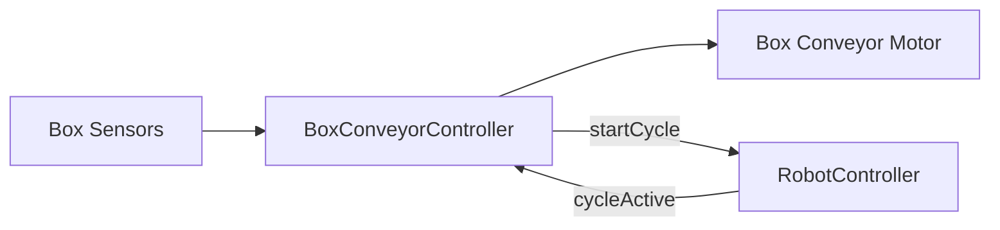

# C# PLC Mini Project System Architecture

이 문서는 `CSharpPlcMiniProject`의 전체 구조와 참조 관계를 설명합니다.  
목표는 Unity 씬을 다시 열었을 때 “어떤 스크립트가 무엇을 제어하고, 어떤 신호를 주고받는지” 빠르게 파악하는 것입니다.


# 동작영상 


## 1. 전체 설계 방향

이 프로젝트는 realvirtual 데모 씬의 설비 모델을 그대로 활용하되, 기존 데모 PLC 스크립트 대신 직접 작성한 C# PLC-style controller가 공정 제어를 담당하도록 구성했습니다.

구분은 다음과 같습니다.

| 영역 | 담당 |
| --- | --- |
| 3D 설비 모델 | realvirtual 씬, 3D prefab, Drive, Sensor, Gripper, MU |
| PLC Signal 컴포넌트 | realvirtual `PLCInputBool`, `PLCOutputBool`, `PLCInputFloat`, `PLCOutputFloat` |
| 캔 공급 제어 | `CanConveyorController` |
| Gantry Pick & Place 제어 | `HandlingController` |
| 박스 공급 및 줄 이동 제어 | `BoxConveyorController` |
| 박스 배출 로봇 제어 | `RobotController` |
| PLC 제어 씬 생성 | `CreateDemoRealvirtualOldScene` |

핵심 원칙:

- 하나의 PLC Signal은 하나의 controller만 제어한다.
- 기존 realvirtual 데모 PLC 스크립트는 비활성화한다.
- Output은 명령, Input은 피드백으로 구분한다.
- Step 기반 상태머신으로 동작 순서를 명확하게 표현한다.

## 2. 상위 시스템 구성도



## 3. 폴더 구조

```text
Assets/
  CSharpPlcMiniProject/
    Docs/
      TroubleshootingSummary.md
      SystemArchitecture.md
    Editor/
      CreateDemoRealvirtualOldScene.cs
    Scripts/
      CanLine/
        CanConveyorController.cs
      Handling/
        HandlingController.cs
        HandlingStep.cs
      BoxLine/
        BoxConveyorController.cs
      Robot/
        RobotController.cs
        RobotStep.cs
      Common/
        RealvirtualIntroSuppressor.cs
```

## 4. 주요 스크립트 역할

### 4.1 `CanConveyorController`

파일:

`Assets/CSharpPlcMiniProject/Scripts/CanLine/CanConveyorController.cs`

역할:

- 캔 공급 컨베이어를 제어합니다.
- 픽업 위치에 캔이 없으면 컨베이어를 구동합니다.
- 픽업 위치에 캔이 감지되면 컨베이어를 정지합니다.
- 캔 감지 상태를 램프로 표시합니다.

주요 참조:

| 필드 | 방향 | 의미 |
| --- | --- | --- |
| `startConveyor` | Output | 캔 컨베이어 구동 명령 |
| `lampCanAtPosition` | Output | 픽업 위치 캔 감지 램프 |
| `sensorOccupied` | Input | 픽업 위치 캔 감지 센서 |
| `buttonConveyorOn` | Input | 작업자 컨베이어 허용 신호 |

동작 요약:

```text
sensorOccupied == false
-> startConveyor = true

sensorOccupied == true
-> startConveyor = false
-> lampCanAtPosition = true
```

### 4.2 `HandlingController`

파일:

`Assets/CSharpPlcMiniProject/Scripts/Handling/HandlingController.cs`

역할:

- Gantry handling 장치를 제어합니다.
- 캔을 컨베이어에서 집어 박스 안에 적재합니다.
- Y/Z Gantry Drive, Gripper, 캔 감지 센서, 박스 준비 상태를 모두 연결합니다.
- 기존 realvirtual `PLC_Handling`을 비활성화하여 신호 충돌을 방지합니다.

주요 참조:

| 필드 | 방향 | 의미 |
| --- | --- | --- |
| `gantryYDestination` | Output | Y축 목표 위치 |
| `gantryYStart` | Output | Y축 이동 시작 펄스 |
| `gantryYAtDestination` | Input | Y축 도착 피드백 |
| `gantryYDriving` | Input | Y축 이동 중 피드백 |
| `gantryYCurrentPosition` | Input | Y축 현재 위치 |
| `gantryZDestination` | Output | Z축 목표 위치 |
| `gantryZStart` | Output | Z축 이동 시작 펄스 |
| `gantryZAtDestination` | Input | Z축 도착 피드백 |
| `gantryZDriving` | Input | Z축 이동 중 피드백 |
| `gantryZCurrentPosition` | Input | Z축 현재 위치 |
| `openGripper` | Output | 그리퍼 열기 명령 |
| `closeGripper` | Output | 그리퍼 닫기 명령 |
| `gripperOpened` | Input | 그리퍼 열림 완료 피드백 |
| `gripperClosed` | Input | 그리퍼 닫힘 완료 피드백 |
| `sensorCan` | Input | 캔 픽업 위치 감지 |
| `boxConveyor` | Object Reference | 박스 컨베이어 PLC-style controller 참조 |

상태 enum:

`Assets/CSharpPlcMiniProject/Scripts/Handling/HandlingStep.cs`

```text
WaitingForCan
MoveToPick
CloseGripper
LiftCan
MoveToPlace
LowerToPlace
OpenGripper
CommandLiftAfterPlace
LiftAfterPlace
ReturnToWaitPosition
```

상태 흐름:



박스 적재 패턴:

- `currentColumnNumber`를 증가시키며 같은 줄의 다음 칸에 캔을 적재합니다.
- `currentColumnNumber > numberOfColumns`가 되면 다음 줄 이동을 요청합니다.
- 다음 줄 이동 요청은 `boxConveyor.driveNextRow = true`로 전달됩니다.
- `currentRowNumber > numberOfRows`가 되면 박스 교체 사이클을 요청합니다.

중요한 충돌 방지:

```text
HandlingController
-> Awake / Start
-> DisableLegacyHandlingControllers()
-> 기존 PLC_Handling 비활성화
```

이 처리가 없으면 기존 `PLC_Handling`과 PLC-style controller가 같은 Gantry 신호를 동시에 써서 Z축 Target이 튀는 문제가 발생합니다.

### 4.3 `BoxConveyorController`

파일:

`Assets/CSharpPlcMiniProject/Scripts/BoxLine/BoxConveyorController.cs`

역할:

- 박스 컨베이어를 제어합니다.
- Gantry 위치에 박스를 공급합니다.
- 한 줄 적재가 끝나면 박스를 다음 줄 위치로 이동합니다.
- 박스가 가득 차면 로봇 배출 위치로 보내고 robot cycle을 요청합니다.
- 기존 realvirtual `PLC_BoxConveyor`를 비활성화하여 신호 충돌을 방지합니다.

주요 참조:

| 필드 | 방향 | 의미 |
| --- | --- | --- |
| `driveNextRow` | Internal Request | Handling controller가 요청하는 다음 줄 이동 |
| `nextRowDistance` | Internal Request | 다음 줄 이동 거리 |
| `boxChangeCycle` | Internal Request | 박스 교체 사이클 요청 |
| `robot` | Object Reference | `RobotController` 참조 |
| `startConveyor` | Output | 박스 컨베이어 정방향 구동 |
| `startConveyorBackwards` | Output | 박스 컨베이어 역방향 구동 |
| `lampBoxAtPosition` | Output | 박스 Gantry 위치 감지 램프 |
| `lampBoxChangeCycle` | Output | 박스 교체 사이클 램프 |
| `sensorGantryOccupied` | Input | Gantry 위치에 박스 있음 |
| `sensorRobotOccupied` | Input | 로봇 위치에 박스 있음 |
| `conveyorPosition` | Input | 박스 컨베이어 현재 위치 |

주요 동작:

```text
일반 공급:
sensorGantryOccupied == false
-> startConveyor = true

Gantry 위치에 박스 도착:
sensorGantryOccupied == true
-> startConveyor = false

다음 줄 이동:
driveNextRow == true
-> rowTargetPosition = conveyorPosition + nextRowDistance
-> startConveyor = true
-> 목표 위치 도달 후 driveNextRow = false

박스 교체:
boxChangeCycle == true
-> 박스를 로봇 위치로 이동
-> robot.startCycle = true
```

중요한 충돌 방지:

```text
BoxConveyorController
-> Awake / Start
-> DisableLegacyBoxConveyorControllers()
-> 기존 PLC_BoxConveyor 비활성화
```

이 처리가 없으면 기존 `PLC_BoxConveyor`가 `StartConveyor`를 덮어써서 다음 줄 이동이 동작하지 않을 수 있습니다.

### 4.4 `RobotController`

파일:

`Assets/CSharpPlcMiniProject/Scripts/Robot/RobotController.cs`

역할:

- 박스가 가득 찼을 때 로봇 배출 사이클을 제어합니다.
- Animator를 사용해 로봇 동작을 재생합니다.
- 박스를 집고 기울여 내부 캔을 배출합니다.
- realvirtual `Grip`, `MU` 기능을 사용해 박스 안의 캔을 제거합니다.

주요 참조:

| 필드 | 방향 | 의미 |
| --- | --- | --- |
| `startCycle` | Internal Request | 박스 컨베이어에서 로봇 사이클 시작 요청 |
| `cycleActive` | Status | 로봇 사이클 진행 중 |
| `robotAnimator` | Object Reference | 로봇 애니메이션 제어 |
| `gripper` | Object Reference | 박스를 잡고 있는 Grip 컴포넌트 |
| `robotAxis6` | Object Reference | 박스 기울임 각도 확인용 축 |
| `gripperOpen` | Output | 로봇 그리퍼 열기 |
| `gripperClose` | Output | 로봇 그리퍼 닫기 |
| `plcStartCycle` | Output | 로봇 사이클 시작 신호 |
| `gripperOpened` | Input | 로봇 그리퍼 열림 피드백 |
| `gripperClosed` | Input | 로봇 그리퍼 닫힘 피드백 |
| `plcCycleActive` | Input | 로봇 사이클 진행 상태 |

상태 enum:

`Assets/CSharpPlcMiniProject/Scripts/Robot/RobotStep.cs`

```text
Waiting
MoveToPick
CloseGripper
DumpCans
PlaceBox
OpenGripper
MoveToWaitPosition
```

상태 흐름:



## 5. 컨트롤러 간 참조 관계



참조 방향:

```text
Can conveyor -> 독립 제어
Handling -> Box conveyor 참조
Box conveyor -> Robot 참조
Robot -> 독립 상태머신
```

즉 상위 공정 흐름은 다음과 같습니다.

```text
캔 공급
-> Gantry가 캔 픽업
-> Gantry가 박스에 적재
-> 한 줄 완료 시 박스 컨베이어 다음 줄 이동
-> 박스 가득 참
-> 박스 컨베이어가 로봇 위치로 이동
-> 로봇이 박스를 비움
-> 새 박스 공급
```

## 6. PLC Signal 흐름

### 6.1 캔 컨베이어 신호



### 6.2 Gantry Handling 신호



### 6.3 박스 컨베이어와 로봇 신호



## 7. 기존 realvirtual PLC 스크립트와의 관계

기존 Demo scene에는 realvirtual의 데모용 PLC 스크립트가 포함되어 있습니다.

대표 예:

- `PLC_Handling`
- `PLC_BoxConveyor`
- `PLC_Robot`

이번 프로젝트에서는 기존 스크립트의 제어 로직을 그대로 사용하지 않고, PLC-style controller가 제어를 담당합니다.

따라서 다음 충돌을 방지해야 합니다.

| 기존 스크립트 | PLC-style 스크립트 | 충돌 가능 신호 |
| --- | --- | --- |
| `PLC_Handling` | `HandlingController` | Gantry Destination, Start, Gripper Open/Close |
| `PLC_BoxConveyor` | `BoxConveyorController` | StartConveyor, StartConveyorBackwards |

현재 처리:

```text
HandlingController
-> DisableLegacyHandlingControllers()
-> PLC_Handling 비활성화

BoxConveyorController
-> DisableLegacyBoxConveyorControllers()
-> PLC_BoxConveyor 비활성화
```

중요한 원칙:

```text
한 PLC Signal은 한 controller만 써야 한다.
```

## 8. 씬 생성 스크립트

파일:

`Assets/CSharpPlcMiniProject/Editor/CreateDemoRealvirtualOldScene.cs`

역할:

- 기존 `DemoRealvirtualOld` 씬의 realvirtual 장비와 신호를 기반으로 PLC control 씬을 생성합니다.
- 기존 PLC 스크립트가 갖고 있던 Signal 참조와 위치 설정값을 PLC-style controller로 복사합니다.
- 생성되는 씬:

```text
Assets/Scenes/DemoRealvirtualOld_CleanControl.unity
```


Unity 메뉴:

```text
Tools > C# PLC Mini Project > Create DemoRealvirtualOld PLC Scene
```

이 스크립트의 핵심 역할:

- 기존 realvirtual 모델은 유지
- PLC controller GameObject 추가
- PLC Signal 참조 연결
- Gantry/Box/Robot 제어 스크립트를 PLC-style 버전으로 교체

## 9. 실행 시 데이터 흐름 예시

### 캔 하나를 박스에 적재하는 흐름

```text
1. CanConveyorController
   - 캔 픽업 위치에 캔이 없으면 캔 컨베이어 구동

2. sensorCan ON
   - HandlingController가 캔 감지

3. HandlingController
   - 그리퍼 열림 확인
   - Gantry를 픽업 위치로 이동
   - 그리퍼 닫힘 확인
   - 안전 높이로 상승
   - 박스 위치로 이동
   - 박스 안으로 하강
   - 그리퍼 열림 확인
   - 안전 높이로 상승
   - 대기 위치 복귀

4. AdvanceBoxPattern()
   - 현재 column 증가
   - 한 줄이 끝나면 boxConveyor.driveNextRow = true

5. BoxConveyorController
   - 다음 줄 위치까지 박스 컨베이어 이동
```

### 박스가 가득 찬 후 배출 흐름

```text
1. HandlingController
   - numberOfRows / numberOfColumns 기준으로 박스가 가득 찼는지 판단
   - boxConveyor.boxChangeCycle = true

2. BoxConveyorController
   - 박스를 로봇 위치로 이동
   - robot.startCycle = true

3. RobotController
   - 로봇 애니메이션 사이클 시작
   - 박스를 집음
   - 박스를 기울여 캔 배출
   - 박스를 다시 내려놓음
   - cycleActive = false

4. BoxConveyorController
   - 로봇 사이클 종료 확인
   - boxChangeCycle = false
   - 새 박스 공급 흐름으로 복귀
```

## 10. 디버깅할 때 먼저 볼 항목

### Gantry 동작이 이상할 때

`HandlingController` Inspector에서 확인:

- `Current Step`
- `Last Command`
- `Last Command Source`
- `Gantry Y Position Status`
- `Gantry Z Position Status`
- `Target Y Position Status`
- `Target Z Position Status`
- `Gantry Y Destination Signal Status`
- `Gantry Z Destination Signal Status`
- `Gantry Y Drive Target Position Status`
- `Gantry Z Drive Target Position Status`
- `Gantry Y Command Accepted Status`
- `Gantry Z Command Accepted Status`

### 박스 컨베이어가 움직이지 않을 때

`BoxConveyorController` Inspector에서 확인:

- `driveNextRow`
- `nextRowDistance`
- `boxChangeCycle`
- `startConveyor`
- `startConveyorBackwards`
- `sensorGantryOccupied`
- `sensorRobotOccupied`
- `conveyorPosition`

### 로봇 배출이 안 될 때

`RobotController` Inspector에서 확인:

- `startCycle`
- `cycleActive`
- `currentStep`
- `robotAnimator`
- `gripper`
- `gripperOpened`
- `gripperClosed`
- `axis6Rotation`
- `unloadedCanCount`

## 11. 현재 구조의 장점

- realvirtual의 설비 모델을 재사용하면서 제어 코드는 직접 작성했습니다.
- PLC식 순차제어 구조를 C# 상태머신으로 표현했습니다.
- 신호 충돌 원인을 분리하고, 기존 demo PLC를 비활성화했습니다.
- 면접에서 설명하기 쉬운 구조입니다.

